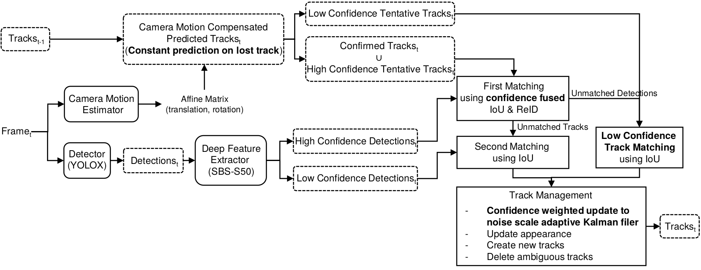

# ConfTrack_WACV2024




> #### ConfTrack: Kalman Filter-based Multi-Person Tracking by Utilizing Confidence Score of Detection Box  
> Hyeonchul Jung, Seokjun Kang, Takgen Kim, HyeongKi Kim  
> [Paper.pdf](https://openaccess.thecvf.com/content/WACV2024/papers/Jung_ConfTrack_Kalman_Filter-Based_Multi-Person_Tracking_by_Utilizing_Confidence_Score_of_WACV_2024_paper.pdf)

# Abstract
Kalman filter-based tracking-by-detection (KFTBD) trackers are effective methods for solving multi-person tracking tasks. However, in crowd circumstances, noisy detection results (bounding boxes with low-confidence scores) can cause ID switch and tracking failure of trackers since these trackers utilize the detector’s output directly. In this paper, to solve the problem, we suggest a novel tracker
called ConfTrack based on a KFTBD tracker. Compared with conventional KFTBD trackers, ConfTrack consists of novel algorithms, including low-confidence object penalization and cascading algorithms for effectively dealing with noisy detector outputs. ConfTrack is tested on diverse domains of datasets such as the MOT17, MOT20, DanceTrack, and HiEve datasets. ConfTrack has proved its robustness
in crowd circumstances by achieving the highest score at HOTA and IDF1 metrics in the MOT20 dataset.

# Installation
```
git clone https://github.com/Hyonchori/ConfTrack_WACV2024.git
```

# Data preparation
1. Download [MOT17](https://motchallenge.net/data/MOT17/), [MOT20](https://motchallenge.net/data/MOT20/), [DanceTrack](https://drive.google.com/drive/folders/1ASZCFpPEfSOJRktR8qQ_ZoT9nZR0hOea), [HiEve](http://humaninevents.org/).  
2. Download [MOT17/MOT20 ground-truth data](https://omnomnom.vision.rwth-aachen.de/data/TrackEval/data.zip) from [TrackEval](https://github.com/JonathonLuiten/TrackEval?tab=readme-ov-file) for evaluation. 
3. Then create MOT17/MOT20 validation set using json files (created by [ByteTrack](https://github.com/ifzhang/ByteTrack))  

```
(in ConfTrack root/lib/datasets/MOT)python ./create_mot_val.py --json_path mot17_val_half.json --mot_root ${MOT17 root} --trackeval_gt_root ${data/gt/mot_challenge} --target-dir 'MOT17-val'

(in ConfTrack root/lib/datasets/MOT)python ./create_mot_val.py --json_path mot20_val_half.json --mot_root ${MOT20 root} --trackeval_gt_root ${data/gt/mot_challenge} --target-dir 'MOT20-val'
```

# Model zoo
```
(ConfTrack root/pretrained)
   |——————detector
   |        └——————yolox
   |                └——————ablation
   |                └——————MOT17_test
   |                └——————MOT20_test
   |                └——————DanceTrack_test
   └——————feature_extractor
             └——————fast_reid
                     └——————MOT17_SBS
                     └——————MOT20_SBS
                     └——————DanceTrack_SBS
```
All weights can be downloaded using this [link](https://drive.google.com/drive/folders/1cCOx_fadIOmeU4XRrHgQ_B5D7tEwJOPx) by [DeepOCSORT](https://github.com/GerardMaggiolino/Deep-OC-SORT?tab=readme-ov-file)

# Tracking
ConfTrack uses a configuration file in ConfTrack_dir/cfgs. All of hyper-parameters, path of files should be edited before execution. 
- ### Test on MOT17/MOT20
```
cd <ConfTrack_dir>
python tools/inference_on_mot.py
    --mot_root ${MOT17/MOT20 root}
    --target_select ${MOT20 or MOT17}
    --target_split ${train or val or test}
    --trk_cfg_file ${configuration file in ConfTrack_dir/cfgs}
```
- ### Test on DanceTrack
```
cd <ConfTrack_dir>
python tools/inference_on_mot.py
    --mot_root ${DanceTrack root}
    --target_split ${train or val or test}
    --trk_cfg_file ${configuration file in ConfTrack_dir/cfgs}
```
- ### Test on HiEve
before execute, edit **cmc_result_dir** in configuration file.
```
cd <ConfTrack_dir>
python tools/inference_on_mot.py
    --mot_root ${HiEve root}
    --target_split ${train or test}
    --trk_cfg_file ${configuration file in ConfTrack_dir/cfgs}
```

# Acknowledgment and Citation
The codebase is built highly upon [BoTSORT](https://github.com/NirAharon/BoT-SORT), [ByteTrack](https://github.com/ifzhang/ByteTrack), [OCSORT](https://github.com/noahcao/OC_SORT), [YOLOX](https://github.com/Megvii-BaseDetection/YOLOX) and [YOLOv5](https://github.com/ultralytics/yolov5). Many thanks for their wonderful works.

    @inproceedings{jung2024conftrack,
    title={ConfTrack: Kalman Filter-Based Multi-Person Tracking by Utilizing Confidence Score of Detection Box},
    author={Jung, Hyeonchul and Kang, Seokjun and Kim, Takgen and Kim, HyeongKi},
    booktitle={Proceedings of the IEEE/CVF Winter Conference on Applications of Computer Vision},
    pages={6583--6592},
    year={2024}
    }
