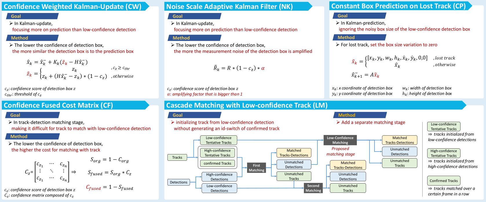

# ConfTrack_WACV2024

> #### ConfTrack: Kalman Filter-based Multi-Person Tracking by Utilizing Confidence Score of Detection Box  
> Hyeonchul Jung, Seokjun Kang, Takgen Kim, HyeongKi Kim  
> [Paper.pdf](https://openaccess.thecvf.com/content/WACV2024/papers/Jung_ConfTrack_Kalman_Filter-Based_Multi-Person_Tracking_by_Utilizing_Confidence_Score_of_WACV_2024_paper.pdf)

# Acknowledgment and Citation
The codebase is built highly upon [BoTSORT](https://github.com/NirAharon/BoT-SORT), [ByteTrack](https://github.com/ifzhang/ByteTrack), [OCSORT](https://github.com/noahcao/OC_SORT), [YOLOX](https://github.com/Megvii-BaseDetection/YOLOX) and [YOLOv5](https://github.com/ultralytics/yolov5). Many thanks for their wonderful works.

    @inproceedings{jung2024conftrack,
    title={ConfTrack: Kalman Filter-Based Multi-Person Tracking by Utilizing Confidence Score of Detection Box},
    author={Jung, Hyeonchul and Kang, Seokjun and Kim, Takgen and Kim, HyeongKi},
    booktitle={Proceedings of the IEEE/CVF Winter Conference on Applications of Computer Vision},
    pages={6583--6592},
    year={2024}
    }
